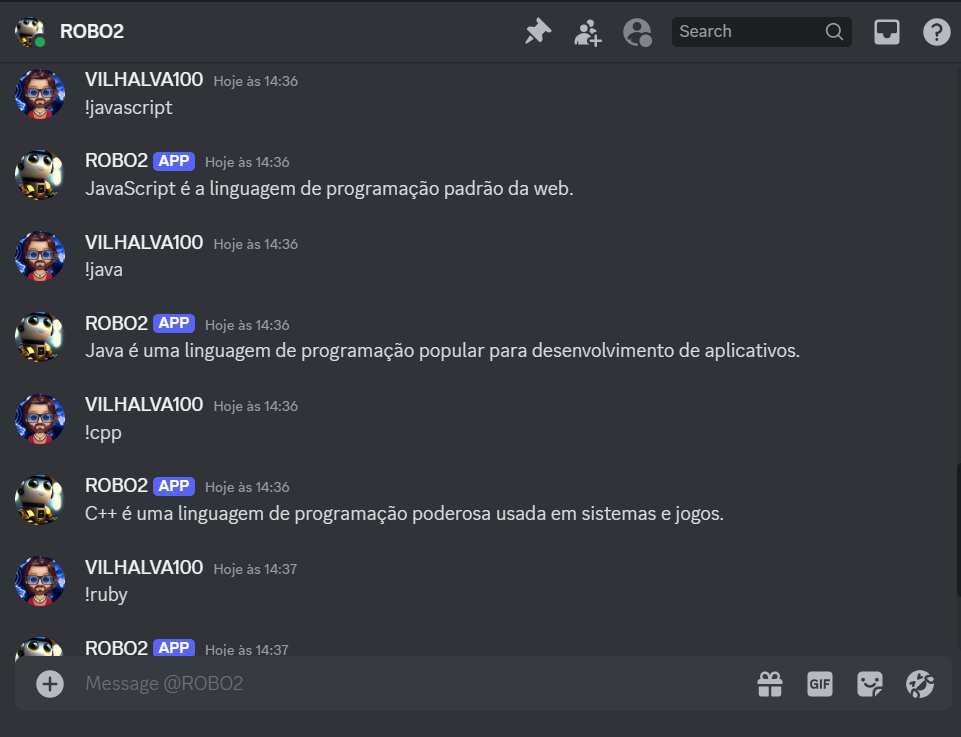
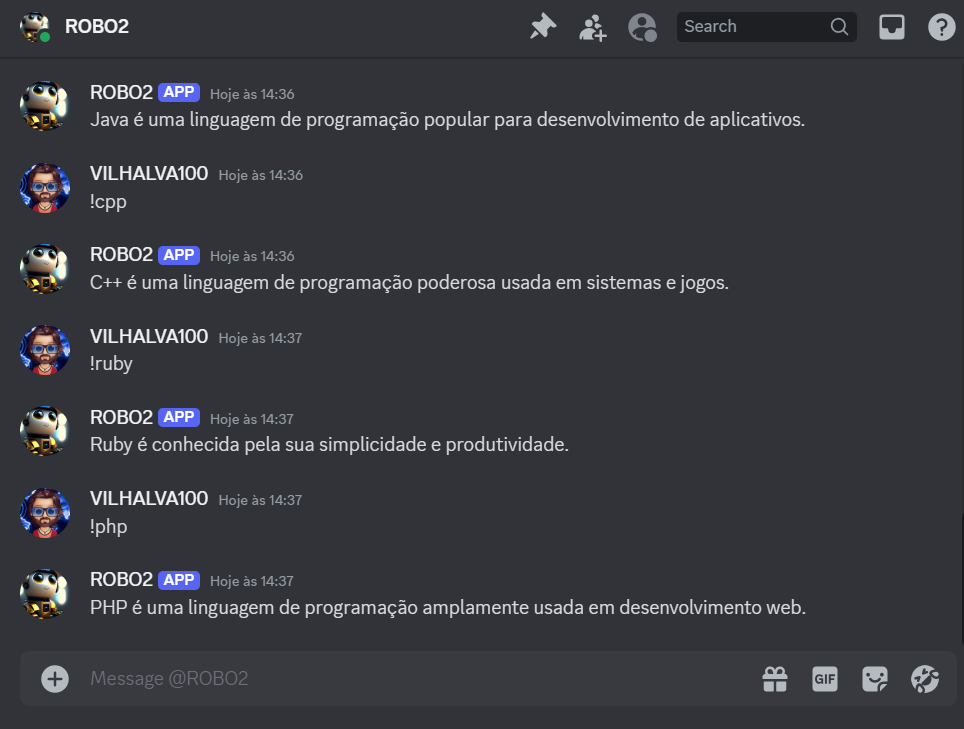

# COMMANDS DE LINGUAGENS
🤖ESTE É UM BOT DO DISCORD FEITO COM DISCORDPY DE COMANDOS BASICOS SOBRE LINGUAGENS DE PROGRAMAÇÃO.

 <br>
 <br>
 <br>

## DESCRIÇÃO:
Este bot Discord foi desenvolvido para fornecer informações simples sobre diversas linguagens de programação através de comandos específicos. Ele usa a biblioteca `discord.py` para interagir com o Discord e responder às mensagens dos usuários.

## FUNCIONALIDADES:
1. **Comandos Gerais:**
   - `!ping`: Retorna "Pong!", indicando que o bot está online e respondendo.
   - `!linguagens`: Mostra um guia de comandos disponíveis sobre linguagens de programação.

2. **Comandos Específicos de Linguagens:**
   - `!python`: Informações sobre Python.
   - `!javascript`: Informações sobre JavaScript.
   - `!java`: Informações sobre Java.
   - `!cpp`: Informações sobre C++.
   - `!ruby`: Informações sobre Ruby.
   - `!php`: Informações sobre PHP.

## EXECUTANDO O PROJETO:
1. **Editar o código:**
   - Certifique-se de substituir `seu_token_aqui` pelas informações corretas das suas credenciais em `CODIGO/TOKEN.py`.

2. **Inicie o Bot:**
   - Execute o bot do Discord iniciando-o com o seguinte comando no diretório `CODIGO`:
    ```bash
    python CODIGO.py
    ```

3. **Interagindo com o Bot no Discord:**
   - **Comando `!ping`:**
     - Digite `!ping` em qualquer canal de texto onde o bot está presente.
     - O bot responderá com "Pong!" para indicar que está online e funcionando.

   - **Comando `!linguagens`:**
     - Digite `!linguagens` para receber um guia de comandos disponíveis sobre linguagens de programação.
     - O bot enviará uma mensagem contendo uma lista de comandos para cada linguagem suportada.

   - **Comandos Específicos de Linguagens:**
     - Para obter informações sobre uma linguagem específica, digite o comando correspondente (`!python`, `!javascript`, etc.) em um canal de texto.
     - O bot responderá com uma breve descrição sobre a linguagem solicitada.

## NÃO SABE?
- Entendemos que para manipular arquivos em muitas linguagens e tecnologias relacionadas, é necessário possuir conhecimento nessas áreas. Para auxiliar nesse aprendizado, oferecemos cursos gratuitos disponíveis:
* [CURSO DE DISCORDPY](https://github.com/VILHALVA/CURSO-DE-DISCORDPY)
* [CURSO DE PYTHON](https://github.com/VILHALVA/CURSO-DE-PYTHON)
* [CONFIRA MAIS CURSOS](https://github.com/VILHALVA?tab=repositories&q=+topic:CURSO)

## CREDITOS:
- [PROJETO CRIADO PELO VILHALVA](https://github.com/VILHALVA)

